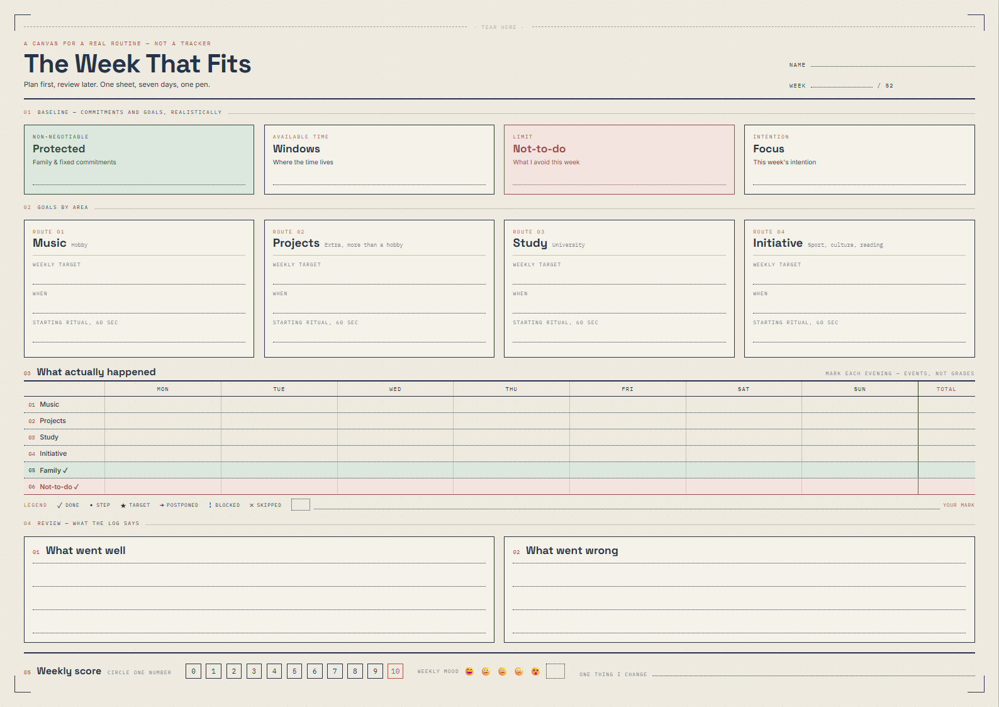

# The Week That Fits

**A weekly planner that fits on one sheet of paper. You fill it in with a pen.**

🤖 [Agent instructions](AGENTS.md) · 🎨 [Customization guide](docs/CUSTOMIZE.md) · 🤖 [Claude instructions](CLAUDE.md)

[](LICENSE)



---

## What it is

One A3 landscape sheet (420 × 297 mm), one week, one pen. You plan on it at the
start of the week and you close the loop on the same sheet at the end — no app,
no streaks, no notifications.

It is a single self-contained `index.html`. No build step, no dependencies, no
JavaScript. Open it in a browser, press `Ctrl+P`, print.

The sheet ships in **English**, with the author's own four life areas already
filled in. That is deliberate: a template full of `Category 01` placeholders
teaches you nothing about how it is meant to be used. Replacing them with yours
is the first thing you should do — see [docs/CUSTOMIZE.md](docs/CUSTOMIZE.md).

## The method

The sheet is built around one idea: **a plan that ignores your real constraints
is not a plan, it is a wish.** So the constraints come first, and the review
comes from evidence rather than memory.

Five blocks, in the order you use them:

| # | Block | When | What it does |
| --- | ------- | ------ | -------------- |
| **01** | **Baseline** | Monday | Four boxes: what is *protected* (family, fixed commitments), where your free *windows* actually are, your *not-to-do* for the week, and your *focus*. |
| **02** | **Goals by area** | Monday | Four "routes" — your life areas. Each gets a weekly target, a *when*, and a 60-second starting ritual. |
| **03** | **Log** | Every evening | 7 days × 6 rows. You mark what actually happened with symbols, not scores. Takes about twenty seconds. |
| **04** | **Review** | Sunday | What went well, what went wrong — read off the log, not off your mood. |
| **05** | **Score** | Sunday | One number 0–10, one mood mark for the week, and one thing you change. |

Three details that carry most of the weight:

- **The log records events, not grades.** ✓ *done*, • *step*, ★ *target*,
  → *postponed*, ! *blocked*, × *skipped*. These simple marks are easy to
  repeat by hand in the table. "Blocked" and "skipped" are different facts and
  the difference is the useful part.
  There is a blank box at the end of the legend to invent your own symbol.
- **The protected row is ticked, not counted.** Family is row 05, on a green
  background, with no target. It is a constraint, not a KPI — the moment you
  score it, you have started optimizing the wrong thing.
- **The not-to-do row is ticked too.** Row 06, red. A week where you avoided
  what you meant to avoid is a good week, even if the targets slipped.

## Print it

Open `index.html` in a browser and press `Ctrl+P`. A small **"Download PDF"**
button sits in the bottom-right corner of the on-screen view — it links to a
pre-rendered, empty copy in `examples/`, for anyone who wants the file without
generating it themselves. No JavaScript involved: it is a static download link
that hides itself when you print or export (`@media print`), so it never shows
up on the sheet itself.

| Setting | Value |
| --- | --- |
| Destination | *Save as PDF*, or your A3 printer |
| Paper size | **A3** |
| Orientation | **Landscape** |
| Margins | **None** |
| Scale | **Default / 100%** — *not* "Fit to printable area" |
| Background graphics | **✅ on** |

**By default, printing already saves ink.** The paper tint covers 100 % of an A3
sheet — tinted, it would saturate a full page every single week. So `index.html`
switches the neutral backgrounds to white specifically for `@media print`, while
keeping them on-screen: what you see on paper is the dot grid, the ink-only
structure, and the two rows that are meant to catch the eye — protected (green)
and not-to-do (red), together covering roughly a tenth of the sheet.

Want the full tinted background on paper anyway? Add `class="print-tinted"` to
`<body>` before printing.

**Background graphics still has to stay on.** Turning it off in the print dialog
kills the dot grid and the two coloured rows along with the tint — you get plain
white with a few lines. The CSS already declares `print-color-adjust: exact`,
but the browser checkbox still has the last word.

An internet connection is needed on first load, for the three Google Fonts. Open
it offline and the typography falls back to system fonts and the spacing drifts.

**Printing on real paper:** the design is full-bleed — the paper tint runs to the
edge of the 420 × 297 mm. No desktop A3 printer can do that; they all keep a
3–5 mm mechanical margin. Print at 100 % and accept a white border: the corner
crop marks are there so you can trim the sheet back to true size. Choosing "fit
to page" instead shrinks everything by about 4 %, and the 6 pt labels go with it.

## Customize it

Everything lives in one file, in two places:

- the **`:root` block** at the top of `index.html` — colours, fonts, paper size;
- the **HTML body** — the four routes, the legend symbols, the labels.

Full instructions, written for both humans and coding agents:
**[docs/CUSTOMIZE.md](docs/CUSTOMIZE.md)**

If you are pointing an AI coding agent at this repository, start it on
**[AGENTS.md](AGENTS.md)** — it carries the hard constraints and the
verification procedure that keeps the sheet exactly A3.

## Repository layout

```text
.
├── index.html          ← the sheet. The only file that matters. Self-contained.
├── AGENTS.md           ← rules and verification steps for AI coding agents
├── CLAUDE.md           ← concise instructions for Claude Code
├── README.md           ← this file (English)
├── LICENSE             ← AGPL-3.0
├── docs/
│   ├── CUSTOMIZE.md    ← how to make it yours (English)
│   └── preview.png     ← rendered sheet
└── examples/
    └── the-week-that-fits.pdf       ← empty, pre-rendered — same file the
                                        on-screen "Download PDF" button serves
```

## Inspiration

The method borrows from two single-page planning traditions, applied to a
different domain — a week instead of a household budget or a business:

- **[Kakebo](https://en.wikipedia.org/wiki/Kakeibo)** (家計簿) — the Japanese
  household-budgeting method, on paper, filled in by hand: you commit to a plan
  at the start of the period and reconcile it against what actually happened at
  the end, on the same page. The plan-then-reconcile rhythm of sections 01–02
  versus 03–05 here is a direct descendant of that discipline.
- **[Lean Canvas](https://leanstack.com/lean-canvas)** (Ash Maurya) — a
  one-page business plan laid out as a grid of numbered boxes, itself adapted
  from the **[Business Model Canvas](https://www.strategyzer.com/library/the-business-model-canvas)**
  (Alexander Osterwalder). The idea this sheet keeps: force a plan into a fixed
  set of small, numbered boxes on a single page, so there is no room to be vague
  and no page 2 to hide in.

Where the design came from *technically*, as opposed to conceptually: the sheet
was mocked up in [Claude Design](https://claude.ai/design) as a `doc-page`
prototype, then reimplemented by hand as a standalone print document. The design
tool's runtime (`doc-page.js`, `support.js`, ~110 KB) was dropped and its
page-box behaviour reduced to a plain
`@page { size: 420mm 297mm; margin: 0 }`. The "modernist" design system it was
nominally built on contributed only a CSS reset — the prototype overrode its
palette and typography wholesale, so the rest was left behind.

## License

Licensed under the **GNU Affero General Public License v3.0** — see [LICENSE](LICENSE).

In short: use it, print it, sell the prints, modify it, build on it — freely.
The conditions are that you **credit the author** and that **your modifications
stay open under the same license**, including when you run a modified version as
a network service.

**Want it under different terms?** If the AGPL does not fit your case —
proprietary use, closed redistribution, commercial licensing — get in touch and
we will sort it out: **[LinkedIn — Massimiliano Camillucci](https://www.linkedin.com/in/massimilianocamillucci/)**

Copyright © 2026 Massimiliano Camillucci
